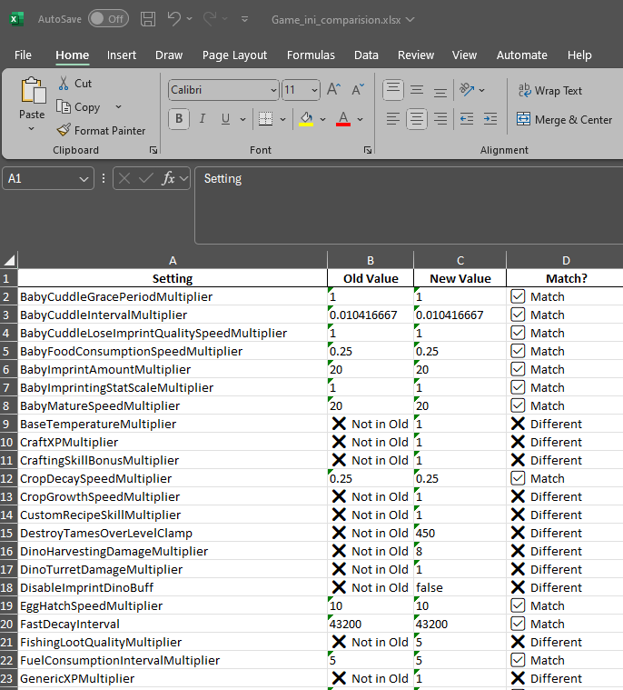
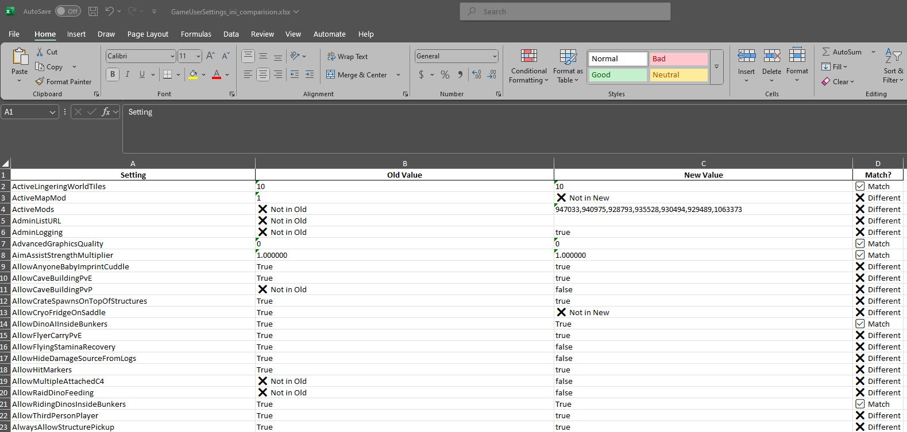

# ASA-Dedicated-Server-Tools

A collection of Python utilities to help manage and maintain **Ark: Survival Ascended** dedicated servers.

These tools are designed for server admins who host their own ASA servers or use third-party Server Managers.  
They make it easier to manage configuration changes, compare INI files, and ensure your settings remain consistent after updates or migrations.

---

## 🧩 Config File Comparison Tool

When switching to a **Server Manager**, your existing `Game.ini` or `GameUserSettings.ini` files may be re-generated or reformatted.  
This can cause your old custom settings to be lost or misaligned with the new format.  
The **Config File Comparison Tool** helps you easily compare your old INI files with newly generated ones and find **exactly which settings have changed, matched, or gone missing.**

---

## ⚙️ How It Works

Each script looks for specific files in the same directory:

| Script | Old File | New File | Output |
|--------|-----------|-----------|---------|
| `compare_game_ini.py` | `Old-Game.ini` | `New-Game.ini` | `Ark_Settings_Comparison.xlsx` |
| `compare_gameusersettings_ini.py` | `Old-GameUserSettings.ini` | `New-GameUserSettings.ini` | `Ark_GameUserSettings_Comparison.xlsx` |

Both scripts read the key/value pairs (`setting=value`), compare them line by line, and export a clean Excel report showing the differences.

---

## 🧠 Why Use This Tool

When migrating to or reconfiguring your Ark server using a **Server Manager** or new hosting platform, it may:
- Overwrite your INI files with default values  
- Drop unsupported or outdated settings  
- Reorder or reformat configuration lines  

This tool ensures your **custom server configurations survive the transition**, by producing a side-by-side Excel comparison of every setting and value.

---

## 📊 Example Output Gallery

Below are sample screenshots showing what the Excel reports look like when comparing two configuration files:

### Game.ini Comparison


### GameUserSettings.ini Comparison


---

## 🖥️ Usage

Place your old and new INI files in the same directory as the scripts and run:

```bash
python compare_game_ini.py
python compare_gameusersettings_ini.py
```

Once complete, Excel files will be generated with all differences clearly marked.

---

## 🛠️ Requirements
- Python 3.8+
- Required libraries:
  ```bash
  pip install pandas openpyxl
  ```

---

## 💡 Planned Tools
- Color-coded Excel highlighting for differences  
- Automated INI backup and restore  
- Mod info fetcher using SteamCMD  
- Server performance logging utility  

---

## 📄 License
This project is licensed under the MIT License — see the [LICENSE](LICENSE) file for details.
