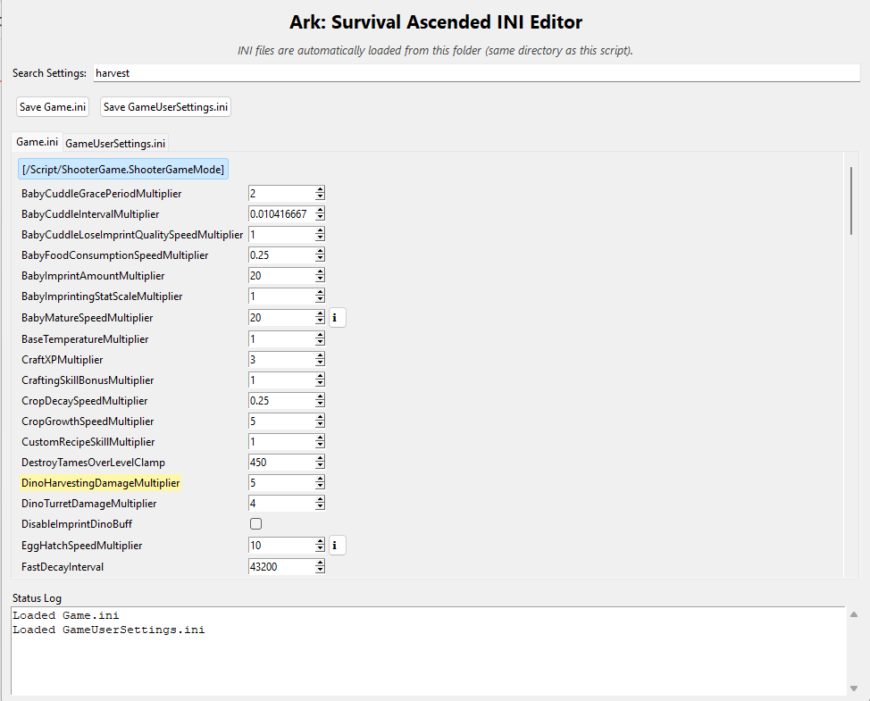

# ASA-Dedicated-Server-Tools

Python-based tools for managing and maintaining **Ark: Survival Ascended** dedicated servers.  
These scripts simplify editing, comparing, and validating server configuration files — making it easier to spot changes, preserve your tuning, and maintain consistency after updates or Server Manager migrations.

---

## 📁 Repository Structure

```
ASA-Dedicated-Server-Tools/
│
├── compare_existing_ini_files/
│   ├── compare_game_ini.py
│   ├── compare_gameusersettings_ini.py
│
├── modify_ini_file_gui/
│   └── ini_editor.py
│
├── images/
│   ├── Game_ini_comparision.png
│   ├── GameUserSettings_ini_compare.png
│   ├── ini_editor.png
│
├── .gitignore
├── README.md
└── LICENSE
```

---

## 🧩 Tool Overview

### 🧮 INI Comparison Tools (`compare_existing_ini_files/`)

These scripts let you compare your **old** and **new** configuration files — for example, when switching to a new Server Manager or after an update that regenerates default INI files.

Each script outputs an Excel file that shows which settings match, differ, or are missing.

#### Files
| Script | Description | Output |
|--------|--------------|--------|
| `compare_game_ini.py` | Compares `Old-Game.ini` vs `New-Game.ini` | `Ark_Settings_Comparison.xlsx` |
| `compare_gameusersettings_ini.py` | Compares `Old-GameUserSettings.ini` vs `New-GameUserSettings.ini` | `Ark_GameUserSettings_Comparison.xlsx` |

#### Example Output
| Setting | Old Value | New Value | Match? |
|----------|------------|------------|--------|
| TamingSpeedMultiplier | 5.0 | 10.0 | ❌ Different |
| XPMultiplier | 2.0 | 2.0 | ✅ Match |

**Example Screenshots:**

  
*Visual comparison output for Game.ini differences.*

  
*Visual comparison output for GameUserSettings.ini differences.*

---

### 🧰 INI Editor GUI (`modify_ini_file_gui/ini_editor.py`)

A powerful yet easy-to-use graphical editor for **Game.ini** and **GameUserSettings.ini**.

#### 🧠 Key Features
- 🗂️ **Automatic loading**: Both INI files load automatically if they exist in the same folder as the script.
- 💾 **Manual save**: Save buttons for each file (`Game.ini` and `GameUserSettings.ini`).
- 🔍 **Live Search Bar**: Instantly highlight settings that match your search — case-insensitive and active across both INI files. Matching rows highlight in **light yellow**, and sections with matches auto-expand.
- 🔍 **Collapsible sections** for clean organization.
- 🧩 **Spinboxes for all numeric values** — allows direct typing or arrow adjustments.
- 🏷️ **Tooltips** (`ℹ️` icons) explaining each setting and its impact.
- ⚙️ **Stat index descriptions** for:
  - `PerLevelStatsMultiplier_Player[#]`
  - `PerLevelStatsMultiplier_DinoTamed[#]`
  - `PlayerBaseStatMultipliers[#]`
  - `DinoBaseStatMultipliers[#]`
- 🔢 **Smart number formatting** — integers save as `5`, decimals as `5.5`, exactly as entered.
- ✅ **Windows / VSCode compatible**, with stable Tkinter theme initialization.

#### 🖥️ Usage
1. Place your `Game.ini` and `GameUserSettings.ini` in the same directory as `ini_editor.py`:
   ```
   modify_ini_file_gui/
   ├── ini_editor.py
   ├── Game.ini
   └── GameUserSettings.ini
   ```
2. Launch the editor:
   ```bash
   python ini_editor.py
   ```
3. Use the search bar to find settings instantly — results highlight in yellow.  
4. Edit settings, use the `ℹ️` buttons for helpful descriptions, then click **Save**.
5. The updated files will overwrite the originals in the same folder.

#### Example Layout
```
[ServerSettings]
TamingSpeedMultiplier=10
XPMultiplier=2.0
bAllowCaveBuildingPvE=true
```

**Example Screenshot:**

  
*Graphical interface with collapsible sections, spinboxes, tooltips, and the new live search bar.*

---

## 💡 Example Workflow

1. Use `ini_editor.py` to tune your settings.
2. If your server manager or an update regenerates default INIs, use the **comparison tools** to check for missing or changed settings.
3. Reapply any custom changes confidently.

---

## 🧱 Requirements

- Python 3.8+
- Dependencies:
  ```bash
  pip install pandas openpyxl
  ```
- Tkinter is included with Python on Windows by default.

---

## 🧭 Notes

- The **INI Editor** is focused on ease of use for local configuration — it’s ideal for server owners or mod testers.
- The **comparison scripts** are ideal for system admins managing multiple servers or cluster setups.

---

## 🧰 Planned Enhancements

- Preset import/export for common configuration templates.
- Optional “Reload Files” button for live reloading during edits.
- Improved Excel color-coding in comparison results.

---

## 📄 License

This project is licensed under the MIT License — see [LICENSE](LICENSE) for details.
